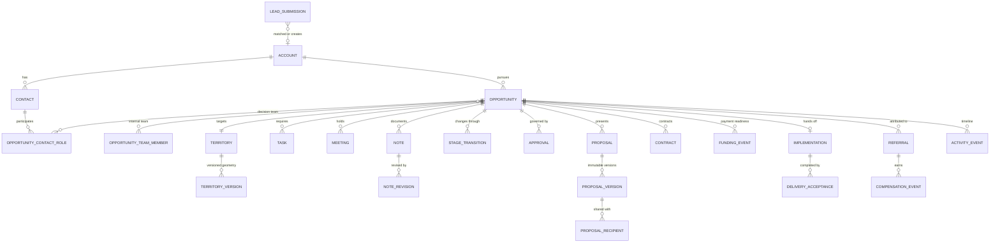
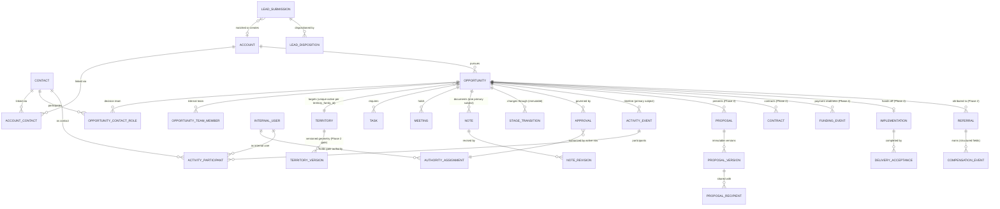

# GHMD Sales Platform — Consolidated Master Architecture & Delivery Brief

**Architecture record:** GHMD-CRM-003 · **Version:** **v1.1 — ADMINISTRATIVE CONSOLIDATION**
**Status:** v1.0 was approved in full by Trace Herchman (2026-07-18, 7:16 PM) and
Bruce Vermeulen (2026-07-18, 7:20 PM) and committed to the repository at `75e664c`
(PR #147). **Supersedes GHMD-CRM-001 and GHMD-CRM-002, effective 2026-07-18.**
This is the governing architecture and delivery document for the GHMD Sales
Platform. **v1.1 is an administrative consolidation, not a re-decision** — it
adds no new architecture and reopens no approved item. Its contents: the eleven
residual items from Sol 5.6's post-approval review (2026-07-18) as adjudicated by
Chat, one already-ruled decision (#178, disposition authority split), the CRM-001
§2 and §17 transcriptions, a governing migration section, the full authority gate
matrix, and the harmonized Appendix A. v1.1 requires **administrative
acknowledgment** by Trace and Bruce (§13.6), not a new approval round. Every v1.1
change is enumerated in §18.
**Provenance:** GHMD-CRM-001 (original architecture) and GHMD-CRM-002 (Foundation MVP
and sequencing) are preserved as decision history, not deleted. This document absorbs
both, plus every correction raised across three rounds of adversarial review, plus the
v0.99 correction pass (Sol 5.6 review of 2026-07-17 as adjudicated by Chat and
confirmed by Trace, 2026-07-18), into one non-contradictory governing brief.
**Prepared for:** Trace Herchman, President, and Bruce Vermeulen, CEO
**Prepared by:** Chat
**Scope:** Authorizes no code, database, permission, integration, deployment, or
production-data change. Governs architecture, MVP boundary, and delivery order for
implementation briefs that follow.

> **v0.99 change log is in §15.** Every change in this pass is editorial precision,
> contradiction removal, or implementation-safeguard correction — no architectural
> redesign. One item required an explicit executive reclassification (§2, approval
> mechanism), recorded there.

---

## 1. Decision

Adopt Account/Contact/Opportunity as the target data model. Introduce it **thin and
together** — Account, Contact, and Opportunity all exist from Phase 1, none deferred,
none faked. An Opportunity that still resolves its business/person identity through
`prospects.id` is not a thin version of the target architecture — it is `deals` under
a new name, carrying the same migration debt forward.

## 2. Confirmed business decisions

Carried forward unchanged from GHMD-CRM-001 §2, plus two resolved in the prior round,
plus one mechanism reclassification recorded in this pass:

- **Qualification & Territory Analyst is a real, currently-occupied Phase 1 role.**
  Leif Isaacson performs it today: qualification review, territory analysis/editing,
  proposal preparation, required-meeting participation.
- **Analyst authority is advisory, not autonomous.** Leif reviews, analyzes, and
  recommends. He does not hold independent approval authority. **Final approval on
  qualification, territory, and proposal-readiness gates requires Trace Herchman or
  Bruce Vermeulen specifically** — the same named-individual pattern already confirmed
  for contract countersignature.
- **Confirmed named-individual, not role-based.** Trace and Bruce, specifically — not
  a broader "Executive designation" — hold this authority, and no expansion is
  expected in the near term. If a third person is ever added, that is a deliberate
  future decision requiring its own sign-off — not something the system should
  silently accommodate by growing the "Executive" designation.
- **Enforcement mechanism (reclassified and corrected this pass — Trace, 2026-07-18,
  "Reading A"):** The prior draft's sentence specifying that the database check
  "hardcodes these two `user_id`s" is reclassified as *implementation detail written
  into the decision text*, not part of the confirmed business decision itself. The
  business rule — named-individual authority, never designation-tested, expansion
  only by deliberate future sign-off — is unchanged and remains confirmed. The
  enforcement mechanism is corrected to a governed **`authority_assignments`** table:
  `user_id`, `approval_gate`, `active_from`, `active_until`, `granted_by`,
  `revoked_by`, `revoked_at`. Only Trace and Bruce hold active rows. The database
  check verifies an active assignment row for the specific gate — **never** a
  designation flag. Rationale for the correction: hardcoded UUIDs cannot survive the
  three-environment split in §7.2 (different `auth.users` UUIDs per project), break
  automated testing, and make temporary suspension or account recreation unsafe.
  **Named invariant (carries into the Phase 1 Schema Contract):** the
  `authority_assignments` table is itself security-critical — no client role may
  write it, every change audited. **Write path hardened (v1.1):** writes occur
  only via (a) database migrations executed by the DB owner, or (b) at most one
  dedicated, audited admin procedure whose caller authorization is itself
  verified — **no general service-role endpoint may write this table**, because a
  general endpoint makes every server-side code path a potential authority-grant
  vector. Granting a
  third person authority is an explicit, logged act with a `granted_by`, which
  enforces the named-individual rule *more* strictly than a hardcode, not less.

All other confirmed decisions in GHMD-CRM-001 §2 stand unchanged.

## 3. Adopted architecture — consolidated

The following are settled after three independent rounds of review and are adopted
without modification to their substance. **Standalone-ness correction (this pass):**
the prior draft claimed to be usable standalone while referring implementers to
GHMD-CRM-001 for load-bearing detail. v0.99 resolves this in two ways: (a) the items
every sprint touches — the ten-stage workflow with corrected authority (below), the
approval mechanism (§2), and the Foundation MVP boundary (§6) — are now fully stated
in this document; (b) the remaining CRM-001 reference material (full ER diagram, RLS
design detail, integration boundaries, UX architecture, testing strategy) is to be
transcribed verbatim into **Appendix A** of this document from the GHMD-CRM-001
source before v1.0 signature — a transcription task, no judgment (see §15, task T-1).
Nobody implementing this system should have to consult a superseded document.
Additionally, **every implementation sprint brief must be fully self-contained** —
briefs never cite "see GHMD-CRM-001 §X" or "see GHMD-CRM-003 §Y" in place of stating
the requirement. The consolidation exists for governance; the briefs carry the spec.

**Ten-stage Opportunity workflow (authority column corrected per §5):**

| # | Stage | Authority |
|---|---|---|
| 1 | Lead Review | Executive/intake authority (duplicate review, Account match, assignment); disposition per Lead conversion lifecycle (§6) |
| 2 | Qualification | Assigned rep conducts; Analyst reviews and recommends; **Trace or Bruce approves** (via `authority_assignments`) |
| 3 | Proposal | Analyst analyzes territory and prepares; **Trace or Bruce approves** |
| 4 | Proposal Review & Validation | Rep + Analyst as required participants; final validation sign-off **Trace or Bruce** *(CRM-001's "/approved substitute" removed per §12 item 9)* |
| 5 | Funding Preparation / Payment Readiness | Finance/Executive, with customer voluntary action |
| 6 | Contracting | Executive; authorized Finance support |
| 7 | Provisionally Secured | Executive/system rule |
| 8 | Funded / Commercially Won | Finance confirmation; Executive correction authority (role-based per §12 item 7) |
| 9 | Delivery & Implementation Handoff | Operations/Implementation or Executive |
| 10 | Sales Complete | Operations/Implementation or Executive |

Required entry evidence and principal system outputs per stage: Appendix A §A.2.
Governed outcomes (Not Ready/Nurture, Closed Lost) and transition mechanics
(immutable `opportunity_stage_transition`, drag-opens-workflow-never-writes-stage,
corrective transitions never rewrite history): Appendix A §A.2.1.

**Summary table of adopted areas** (full detail lands in Appendix A per T-1):

| Area | Summary |
|---|---|
| Core domain model | Account ⟶ Contact, Opportunity ⟶ Territory; Notes/Revisions, Activity Events, Stage Transitions, Approvals as first-class records |
| Role model shape | Rep, Analyst, Executive, Finance, Operations, Admin, future-manager. **Approved-substitute removed entirely (this pass)** — see §12 item 9; it no longer appears in any role list, Phase 1 or later. |
| Database/auth architecture | RLS on every exposed table, membership-based not broad-internal-user, immutable transitions/events, no hard delete for business records |
| Integration boundaries | Box (files/signatures), Outlook/M365 (email/calendar), Zoom, Calendly, Mapbox/PostGIS (geometry), iLeaseWorks, QuickBooks |
| Territory and National Map | Draft → validated → Analyst/Executive-approved → immutable version; gold after Proposal Review, gold+text after execution, green after funding |
| UX and information architecture | Role-specific home pages built from owned work, not generic dashboards |
| AI architecture | Recommend/draft/summarize only; human approves every material decision; every output cites sources |
| Testing strategy | Domain rules, adversarial permission matrix, end-to-end acceptance scenario |
| Consequences and trade-offs | Foundation-first costs more up front, prevents compounding rework later |

## 4. Verified current-state findings

| Finding | Status |
|---|---|
| `AUTH_GATE_DISABLED=true` across every deployment context, including production | **Confirmed live** (Netlify env vars). **Governance note (this pass):** this state exists by explicit standing decision (#136/#137), re-noted in every session handoff — it is a deliberate choice while no real data exists, not a lapsed oversight. §7's PR-0a **revises that standing decision**; the revision must be recorded in `ops.decision_log` (superseding/revising #136/#137) before or with PR-0a — never a migration that silently contradicts the log. |
| Production and preview deployments share one Supabase project | **Confirmed live** — identical `NEXT_PUBLIC_SUPABASE_URL` and `SUPABASE_SERVICE_ROLE_KEY` across dev, branch-deploy, deploy-preview, and production. **Consequence note (this pass):** the QA-exec deploy-preview login model (`scripts/qa/preview-login.ts` hostname guard) is premised on exactly this single-project topology. §7.2's environment separation dissolves that premise; the PR-0c brief must redesign the QA-exec model for a three-project world. The guard is designated security-sensitive in CLAUDE.md — this is a designed change, not a drive-by. |
| PostGIS `spatial_ref_sys` exposure | **Confirmed live and re-confirmed current 2026-07-18** (`get_advisors`: ERROR-level, RLS disabled). `anon` and `authenticated` hold `SELECT`/`INSERT`/`UPDATE`/`DELETE`/`TRUNCATE` grants. **Proven:** an anonymous or authenticated caller can `DELETE` every row through the standard public REST interface — sufficient alone to corrupt every geometry/SRID-dependent query. **Not yet proven:** whether raw `TRUNCATE` is reachable through REST. Severity unchanged by the distinction. |
| `deals` / `activities` broad RLS | **Independently confirmed** via a full 24-table policy sweep. Eleven other tables already use correct ownership/membership-scoped RLS — reuse those patterns rather than inventing new ones. |
| Privileged-function grants | Confirmed present via `get_advisors` (re-confirmed 2026-07-18: `rls_auto_enable` and `gate_decision_for_pr` anon-executable; `st_estimatedextent` variants anon-executable; several identity-gated deal RPCs authenticated-executable by accepted design). **A full grant-by-grant audit of every `SECURITY DEFINER` function has not been re-run** — required before PR-0d is scoped in detail. **CI-dependency caveat (this pass):** `gate_decision_for_pr`'s public executability may be load-bearing — the Second-Opinion Gate workflow calls it from GitHub Actions. PR-0d must verify how `.github/workflows/second-opinion-gate.yml` authenticates **before** any revoke, and must treat almost-certainly-accidental exposure (`rls_auto_enable`, `st_estimatedextent`) separately from possibly-deliberate exposure. Do not brick the project's own governance gate. |

## 5. Corrected role/authority model

**Qualification & Territory Analyst:** Reviews qualification, analyzes and edits
territories, prepares proposals, joins required meetings. **Recommends; does not
independently approve.** Final approval on qualification-complete,
territory-approved, and proposal-ready gates requires Trace Herchman or Bruce
Vermeulen specifically.

**Stage-authority corrections** are incorporated directly into the §3 ten-stage table
(stages 2–4).

**Database implication:** the `approvals` authorization check for these three gates
verifies the actor holds an **active `authority_assignments` row for that specific
gate** (§2) — **not** "any user holding Analyst or Executive designation," and **not**
a hardcoded UUID pair. Building it as a designation check would grant Leif approval
authority the business decision in §2 explicitly withholds from him; building it as a
hardcode fails the three-environment topology in §7.2.

*(The prior draft's parenthetical "or the confirmed executive designation, pending
§12's open item" is removed — no such open item exists in §12, and designation-based
approval was already rejected in §2. Contradiction eliminated this pass.)*

## 6. Foundation MVP versus Target Architecture

| Record | Foundation MVP (Phase 1) | Deferred to Phase 2+ |
|---|---|---|
| **Lead Submission** | A thin intake record (source, submitted-by, business name, primary Contact + one contact method, territory interest, rep attribution, disposition) *before* Account/Opportunity creation. **Conversion lifecycle defined this pass (was ambiguous — different developers could have treated this as a temp form, another Prospect table, or a permanent source record; it is a permanent source record):** (1) lead submitted → (2) duplicate candidates evaluated → (3) lead accepted or rejected → (4) existing or new Account selected → (5) existing or new Contact selected → (6) Opportunity created → (7) original lead **permanently linked** to the resulting Account/Contact/Opportunity → (8) attribution and original submission data preserved immutably. | Full duplicate-detection tooling, referral-chain automation. |
| **Account** | One record per business: name, primary location, owner, restriction level. **Matching corrected this pass (removes the §6/§12 contradiction):** matching on normalized name/domain/phone **proposes** candidates; ambiguous matches route to a review queue. An exact verified email or phone match identifies a likely existing **Contact** — it does **not** automatically establish an Account relationship unless that relationship already exists. Likely matches are presented to an authorized reviewer. **Accounts are never auto-merged.** Every link and merge decision is recorded immutably. Rationale: emails/phones identify people, not businesses — attorneys, lenders, spouses, shared office numbers, and reused numbers make automatic Account linking a cross-Account disclosure risk. | Fuzzy matching, merge UI, multi-location management. |
| **Contact** | Basic record (name, email, phone, relationship label). **Multiple Contacts per Account/Opportunity from day one.** Minimum consent fields: preferred channel, do-not-contact flag, verification date — full consent *automation* can wait, but the system must record "do not contact this person" before real outreach begins. **Schema-shape note (v1.1):** model consent per **channel** (email, SMS, phone), not as a single Contact-level boolean — a person who says "no texts" has not said "no email," and SMS consent carries distinct regulatory obligations. Phase 1 may populate only one channel row, but the shape must be per-channel from the first migration so Phase 2/3 outreach doesn't require a schema rework mid-consent-history. | Governed role taxonomy, consent automation, portal identity linking. |
| **`account_contacts` / `opportunity_contact_roles`** | Explicit relationship tables. A Contact cannot be represented as belonging to only one Account — attorneys, CPAs, lenders, and referral sources span relationships a single foreign key can't express. | Rich role-influence scoring, approval-requirement flags. |
| **Opportunity** | Account + Territory + owner + basic team + stage + primary next action/owner/due date + restriction flag. **Uniqueness invariant, refined this pass:** at most one active Opportunity per Account/Territory pair, enforced by a partial unique index keyed on a **stable territory identity** (`territory_family_id` or equivalent) that survives future Territory Version creation — not the raw territory row ID, which versioning would silently fork. "Active" stages, the behavior of Not-Ready-Yet, whether an Opportunity may temporarily exist without a Territory, and redraw semantics are **defined in the Phase 1 Schema Contract** (a named required section, not left to per-sprint interpretation). Geometric overlap detection between differently-identified territories is **deferred** to the Territory Versioning gate before Phase 2 — a stable ID is cheap; overlap geometry is real PostGIS work and out of scope for a thin foundation. | Overlap-warning tooling; field-level value/commercial-summary separation beyond a basic restriction flag. |
| **Opportunity Team Membership** | Minimum fields: `assigned_by`, `assigned_at`, `removed_by`, `removed_at`, `active`. A boolean alone would erase who previously had access. A separate full history table can wait *if* the audit log captures these changes immutably. | Assignment-reason free text, effective-dated role changes. |
| **Notes / Revisions / Stage Transitions** | From Phase 1. Notes and Revisions carry **one primary subject** (Account, Contact, or Opportunity via explicit multi-FK, exactly one non-null). Stage Transitions belong to exactly one Opportunity, immutable from/to/actor/timestamp/reason, non-deferrable. Pin stays executive-approve-only. | Pin suggest/approve workflow. |
| **Activities** | **Corrected this pass — the exactly-one-subject rule was too restrictive for Activities.** An email or meeting often belongs simultaneously to an Opportunity, one or more Contacts, and the Account. Activities carry a **primary Opportunity or Account** plus an **`activity_participants`** relationship table for Contacts and internal users. An email must retain its exact Contact recipients *and* its Opportunity context — forcing one subject either loses context or duplicates records. | Richer activity typing/threading. |
| **Audit minimum** | Phase 1 audits, at minimum: role/membership changes, **authority-assignment grants and revocations (added this pass, per §2)**, restricted-record access, exports, Account merges, stage transitions, approvals and exceptions, note corrections/archives, owner changes, permission changes. | Full observability across every action type. |
| **Territory** | Keep the existing `territories` table and its `qa_locked` protection. Re-point the foreign key from `prospect_id` to `opportunity_id` **via a controlled adapter and cutover, not a bare column swap** (live dependents exist). Introduce the stable `territory_family_id` identity in Phase 1 (needed by the uniqueness invariant above). | Full Territory Version immutable lineage. `qa_locked` prevents a governed row from being overwritten — it does not provide version identity, rollback, proposal-to-territory linkage, contract-exhibit linkage, or supersession history. **Territory Versioning is a hard gate before any Phase 2 proposal/contract/negotiation work goes live** — a precondition for starting it, not a nice-to-have inside it. |
| **Proposal, Contract, Payment Readiness, Funding, Implementation, Referral, Compensation** | Not Phase 1. Correctly scoped to Phase 2+. **Sequencing correction for Phase 2 (this pass):** if proposal identity verification (§12 item 4) lands on emailed magic links or emailed access codes, the **transactional proposal-access email capability must exist in Phase 2** — it cannot depend on Phase 3's full Graph mailbox/Outlook-synchronization work. Transactional send (single-purpose, @gethairmd.com sender per §12 item 11) is separated from mailbox synchronization; only the latter is Phase 3. | — |
| **Roles** | Rep, Executive (Trace/Bruce), and **Analyst (Leif, advisory authority per §5)** are the three occupied Phase 1 roles. Build the permission *structure* (membership-based RLS) to accommodate Finance/Operations/Admin without a future schema rework, but don't build UI or queues for roles nobody holds. | Finance, Operations, Admin, future-manager — stood up when occupied. *(Approved-substitute: removed entirely, all phases — §12 item 9.)* |

## 7. Phase 0 — Security containment

Immediate containment precedes environment separation: the live, unauthenticated gaps
should not wait for a multi-day separation project.

### 7.1 Immediate containment — the emergency wave (expanded this pass)

| PR | Closes | Adversarial verification |
|---|---|---|
| 0a | Restore authentication + deployment guard. **Guard rule (v1.1, simplified per Sol):** the `AUTH_GATE_DISABLED` bypass is permitted **only** in explicit local development against synthetic data; **every hosted Netlify context — production, branch-deploy, deploy-preview, dev — fails the deployment (build aborts) if the variable is set.** No "real-data context" runtime detection: hosted = enforced, period. Simpler to reason about, impossible to misconfigure by data-state drift. **Prerequisite: the `ops.decision_log` entry revising standing decisions #136/#137 (§4).** | Direct-URL and direct-API tests against every internal route, unauthenticated, confirm redirect/deny; a deliberate test deploy with the variable set confirms the build fails closed |
| 0b | Revoke anonymous/authenticated write privileges on PostGIS system objects (emergency, **tested** migration) | Confirm `anon`/`authenticated` `DELETE`/`INSERT`/`UPDATE`/`TRUNCATE` grants removed; territory-sizing regression suite passes after |
| 0g *(moved into the emergency wave this pass — it is near-zero-cost, time-sensitive, and has no dependency on environment separation; the repository having been public at any point means credentials may already be harvested regardless of current visibility)* | Credential review and rotation for anything potentially exposed while the repository was public. Rotations performed by Trace directly in the respective consoles — **never through an agent session**; Coder verifies no secrets remain in repository history. | Confirmed rotated; confirmed clean history |
| 0d-interim *(added this pass)* | Triage of accidental anon-executable privileged functions (`rls_auto_enable`, `st_estimatedextent` variants at minimum). **Precondition: verify the Second-Opinion Gate workflow's authentication path before touching `gate_decision_for_pr`** (§4 caveat). Full audit remains 0d in §7.4. | Revokes confirmed live; gate workflow confirmed still functional on a test PR |

### 7.2 Environment separation

| PR | Closes |
|---|---|
| 0c | Separate Development, Staging, and Production Supabase projects, credentials, Netlify contexts, Box locations, and integrations. **Includes the redesigned QA-exec / deploy-preview login model for the multi-project topology (§4).** |

### 7.3 Re-verify the emergency wave inside the separated environments

Confirm 0a, 0b, 0g, and 0d-interim hold correctly once environments are actually
separated — not assumed to have carried over cleanly.

### 7.4 Remaining hardening

| PR | Closes | Adversarial verification |
|---|---|---|
| 0d | Privileged-function hardening — **full grant-by-grant audit first**, all `SECURITY DEFINER` functions, deliberate-exposure vs. accidental-exposure classified explicitly | Minimum execute grants, safe search paths, adversarial tests |
| 0e | `deals`/`activities` RLS fix, **documented explicitly as a bridge control** — the own-records-only invariant is durable; the `prospects.assigned_rep_id` enforcement mechanism is not and will be rewritten against Opportunity Team membership in Phase 1 | Rep A cannot read Rep B's deal or note, before and after |
| 0f | Safe error handling | No raw `permission denied for table X` reaches the browser; protected trace ID in its place |
| 0h | MFA, unique accounts, session revocation, immediate offboarding, role-eligibility expiration | Offboarding test: access actually revoked, not just flagged |
| 0i | Backup/restore verified, incident-response ownership and escalation defined, retention rules by record type. **Restore-test scope corrected this pass:** the test must be **timed end-to-end** and must cover Auth, Storage, functions, secrets, Netlify configuration, Box references, and integration configuration — not only PostgreSQL. See §12 item 1 for the corrected RPO/RTO wording. **Retention-operations addendum (v1.1):** the PR-0i retention runbook must additionally cover — (a) Box retention-policy configuration implementing §12 item 2 (permanent retention for closed-deal records; never-auto-delete default everywhere); (b) a legal-hold mechanism that suspends any deletion/archival eligibility for named records regardless of age; (c) the narrowly-controlled counsel-directed deletion path — the only route to hard deletion, requiring Executive authorization, counsel direction on record, and separate audit; (d) Contact correction/deletion-request handling (a person asking GHMD to correct or delete their information) — **this sub-item gets a Rick Dahlson review when the runbook is drafted, not an improvised policy**, because request-handling obligations interact with the 506(b) record-preservation duties in §12 item 2. | A real, timed restore test, not a documented intention; retention runbook drafted with the counsel check on (d) recorded |

## 8. Phases 1–4

**Phase 1 (Foundation MVP):** the complete §6 matrix, including the additions.
**Exit gate:** core records and governed workflow operate on migrated dummy data,
pass the adversarial permission tests (GHMD-CRM-001 §19.2, Appendix A) rewritten
against Opportunity Team membership, and the §5 approval-authority model is enforced
at the database level via `authority_assignments`, not just in UI.

**Phases 2–4:** unchanged from GHMD-CRM-001 §20 (Appendix A §A.8), except: (a)
Phase 2 explicitly gates on Territory Versioning being complete before any
proposal/contract/negotiation work inside it begins; (b) Phase 2 includes the
transactional proposal-access email capability if §12 item 4 resolves to an emailed
mechanism (§6); (c) approved-substitute language is removed wherever it appears in
inherited Phase 2–4 material (§12 item 9); (d) **Phase 2 backlog: proposal content
submission UI must support a counsel-review-required gate before a new claim is
marked active** (§12 item 5, Option A).

## 9. Four readiness milestones

Four separate, explicit sign-off gates. None is silently treated as implying the next:

1. **Security Containment Complete** — all of §7 closed and verified.
2. **Foundation MVP Complete** — Phase 1 (§8) shipped and adversarially tested.
3. **Limited Pilot Ready** — milestones 1 + 2, for a small controlled group, still
   not the full sales process. **Hard preconditions (v1.1) — no real lead enters
   the system before all three are done and evidenced:** (a) **PITR enabled** on
   the production Supabase project (per §12 item 1's trigger — this milestone is
   that trigger's latest permissible moment); (b) **the timed, full-scope restore
   test from PR-0i actually executed**, with the measured duration recorded as
   the real RTO; (c) **the Pilot Runbook written** — who is in the pilot, what
   data they may enter, the incident-response path, and the rollback/stop
   condition. These are sign-off evidence for this milestone, not aspirations
   attached to it.
4. **Full Sales Process Ready** — Phase 2 complete, including the Territory
   Versioning gate.

## 10. Disposition of work already in flight

Unchanged from GHMD-CRM-002 §9: Prospect Activity Log brief held (superseded by
Phase 1); `deals`/`activities` RLS fix proceeds as PR-0e inside §7.4, documented as a
bridge control; email/SMS work held (Phase 3 territory for mailbox sync; transactional
proposal-access email is Phase 2 per §6, and needs Contact, not Prospect, once
Phase 1 lands).

**Repo-governance alignment (added this pass — implementation-blocking, owner:
Coder via a docs PR at Sprint G):** adopting this brief pauses the
`docs/SALES-OS-SPEC.md` Session E queue (E-4 Email & SMS Template Gallery, E-5
Events). Standing protocol routes Coder to `handoffs/LATEST.md` and `CLAUDE.md` at
session start; those documents currently point at Session E. Before any Phase 0
session opens, a docs-alignment PR must: (a) record the program pivot in the handoff;
(b) freeze the Session E queue with an explicit pointer to this brief; (c) supersede
the "12-stage pipeline" Locked Technical Fact in `docs/AGENTS.md` with the ten-stage
Opportunity workflow (with a matching `ops.decision_log` supersession entry) —
effective at Phase 1 cutover, with the 12-stage model remaining accurate for the
live legacy system until then. Without this, protocol itself routes the next Coder
session into superseded work.

## 11. What changed in the CRM-003 merge (prior round), for the record

- Phase 0 reordered: immediate containment before environment separation.
- Three Phase 0 gate categories added: credential rotation, MFA/session/offboarding,
  backup/restore/incident response.
- Foundation MVP additions: Lead Submission, `account_contacts` and
  `opportunity_contact_roles`, the Account/Territory uniqueness invariant, Contact
  consent minimum fields, Opportunity Team membership history fields, a specified
  audit minimum.
- Territory Versioning rationale corrected: `qa_locked` protects a governed row, not
  version lineage — Versioning deferred from Phase 1 but hard-gated before Phase 2
  proposal/contract/negotiation work.
- PostGIS finding reworded for precision: `DELETE`-at-REST confirmed;
  `TRUNCATE`-at-REST not yet proven; severity unchanged.
- "Three independent passes" language removed.
- Analyst role resolved: Leif, real, occupied, advisory authority only; Trace/Bruce
  hold final approval.
- Two governing documents merged into one.

## 12. Decisions from GHMD-CRM-001 §22 — status

1. **Backup RPO/RTO — wording corrected this pass.** Supabase Pro daily backups with
   7-day retention are active today at no cost; that much is confirmed. **RPO: 24
   hours (backed by Supabase's backup cadence). RTO: same business day (~4 hours) is
   a GHMD target, not a Supabase guarantee** — the project is inaccessible during
   restoration, restore duration depends on database size, and database backups do
   not restore deleted Storage objects. The 4-hour figure may not be *claimed as
   achieved* until PR-0i's timed, full-scope restore test measures it; the measured
   number becomes the recorded RTO. Trigger to tighten (enable the PITR add-on,
   dropping RPO to minutes): **Foundation MVP Complete or Limited Pilot Ready** —
   before real data, not on a calendar date. *(Whether PITR is currently enabled
   wasn't independently verifiable through available tooling — confirm in
   Dashboard → Database → Backups.)*
2. **Retention — resolved (counsel confirmed via Trace, 2026-07-18).** The 2-year
   figure is a **minimum**, not an auto-delete trigger, and it applies **only to
   deals that do not close** (stagnant, Lost, rejected leads, and their
   transcripts/engagement data). **All closed-deal information — including signed
   licensee contracts, funding/payment records, and any records tied to the active
   506(b) offering on a closed deal — goes into permanent Box.com retention and is
   never deleted.** For non-closed records, GHMD holds the option, after the 2-year
   minimum, to either (a) retain indefinitely or (b) move stagnant/Lost deals to
   the permanent archive; **system default: never auto-delete anywhere** — any
   deletion or archival move is a manual, authorized, logged act, permissible only
   after the 2-year minimum, and any deletion of 506(b)-adjacent records on
   non-closed deals gets a counsel check at the time it is exercised.
   Implementation lands in PR-0i's retention-rules-by-record-type work (§7.4) and
   the Box system-of-record pattern (Appendix A §A.5).
3. **Account-match/merge — corrected this pass to remove the contradiction with §6.**
   The prior "exact email or phone match auto-links to an existing Account" rule is
   replaced by §6's rule: exact verified email/phone identifies a likely existing
   **Contact**; Account relationships are proposed to an authorized reviewer, never
   auto-established, never auto-merged; every link/merge decision recorded
   immutably. §6 is authoritative; this item now defers to it.
4. **Proposal identity verification:** deferred to Phase 2 scoping. Options on
   record: (A) email magic link, (B) SMS one-time passcode (requires a separate
   SMS-provider decision), (C) keep the current access-code model, (D) auto-deliver
   the existing access code via email. Leaning (A) or (D). **Sequencing note (this
   pass):** if (A) or (D) is chosen, the transactional-send capability is a Phase 2
   deliverable (§6) — it does not wait for Phase 3's Graph mailbox work.
5. **Claims/case-study/ROI approval — resolved (counsel confirmed via Trace,
   2026-07-18): Option A.** Existing content is already counsel-reviewed and needs
   nothing. **Every new claim, case study, ROI figure, territory revenue
   projection, or earnings-adjacent item added in the future requires a fresh
   off-system counsel review before it can appear in any proposal.** Per the
   standing instruction for this outcome, the Phase 2 brief backlog gains:
   **"Proposal content submission UI must support a counsel-review-required gate
   before a new claim is marked active"** (recorded in §8 and Appendix A §A.8).
   Standing decisions #68/#71 (`legal_flag: true` on existing earnings-claim
   content) remain untouched in `ops.decision_log` and continue to independently
   block live prospect sends until Trace explicitly directs their update.
6. **Provisional-hold extensions: unlimited after the initial 30 days. Each
   extension requires Bruce or Trace's explicit approval** — covered by the §6 audit
   minimum ("approvals and exceptions").
7. **Funding correction authority: Executive or Admin role** — role-based, not
   named-individual. Deliberately distinct from the §2 rule.
8. **Sanitized-shell fields for restricted Opportunities: presence-only, with one
   exception.** Active: existence for the Territory + generic "restricted — contact
   Trace or Bruce" marker only. **Once sold (Funded/Commercially Won or equivalent),
   the shell additionally reveals the business/Account name** — confidentiality
   protects an active negotiation, not a closed one. Contact details, value, terms,
   and notes remain hidden regardless. *(Executive-approval note: Sol's review flags
   that this means even strategic/KOL identities disclose to all reps after funding
   — item for the §14 approval session to explicitly reconfirm, not silently
   inherit.)*
9. **Approved-substitute policy: removed, not deferred — everywhere (this pass
   completes the removal §3 and Phases 2–4 previously still carried).** If a
   required participant can't attend, the meeting is rescheduled. No substitute
   mechanism exists or is planned, at any phase.
10. **Compensation: no calculation engine, at any phase — but not entirely free
    text (corrected this pass).** Compensation Events (Phase 2) carry: restricted
    `terms_text`, optional numeric `amount`, `currency`, `payee`,
    `arrangement_type`, `approval_status`, `approved_by`/`approved_at`,
    `paid_status`/`paid_at`. Known monetary amounts are never stored *only* inside
    prose — this provides reporting and auditability without calculating
    compensation automatically.
11. **Authorized mailboxes for email integration: @gethairmd.com company accounts
    only.** No personal-account sends. Applies equally to Phase 2 transactional
    sends and Phase 3 mailbox sync.
12. **Notification timing: tiered, not uniform.** High-intent triggers (financing
    CTA click, get-started click) — instant, to the assigned rep. Lower-intent
    triggers — batched digest, once or twice daily. Executives: digest by default,
    instant only for their own Executive-Restricted deals.

**All items in this section are confirmed.** (Items 2 and 5 resolved 2026-07-18 —
counsel input obtained by Trace directly; recorded here on Trace's confirmation.)

## 13. Executive sign-off tracking

Items 1–3 below were confirmed in an earlier round; recorded here as history, not
re-decided:

1. **Phase 0 sequence — confirmed** (including environment separation explicitly
   kept, not skipped). The v0.99 wave-1 expansion (0g and 0d-interim moved forward)
   is a sequencing refinement within that confirmation, flagged for §14
   re-confirmation only because it changes what "wave 1" contains.
2. **Foundation MVP additions in §6 — confirmed** (v0.99 refinements flagged for §14).
3. **Four readiness milestones in §9 — confirmed.**
4. **Former open sub-items (§12 items 2 and 5) — resolved 2026-07-18** with counsel
   input obtained by Trace: retention policy (2-year minimum, non-closed deals
   only, closed deals permanent in Box, never auto-delete) and Option A
   counsel-check for new proposal content.
5. **Trace Herchman approved all §14 items in full, 2026-07-18, 7:16 PM. Bruce
   Vermeulen approved all §14 items in full, 2026-07-18, 7:20 PM. Document is
   v1.0 — APPROVED.**
6. **v1.1 administrative acknowledgment (pending):** v1.1 (§18) is consolidation,
   not re-decision — the only genuine decision it carries, the disposition
   authority split, was already ruled by Trace and recorded as `ops.decision_log`
   #178 on 2026-07-18. Acknowledgment slots: Trace Herchman — ______ · Bruce
   Vermeulen — ______. Acknowledgment confirms the consolidation faithfully
   records what was already decided; it does not reopen §14.

## 14. Acceptance

This document becomes **GHMD-CRM-003 v1.0 — Approved** upon the executive approval
session. Conversational confirmation in working sessions is recorded in §13 as
history; it is **not** formal joint executive approval. The approval session covers
only the decisions that materially affect authority, confidentiality, or sequencing:

| Item | Trace | Bruce | Notes |
|---|---|---|---|
| Account/Contact/Opportunity, thin and together, as Phase 1 | ☑ 2026-07-18 | ☑ 2026-07-18 | |
| Named-person approval model via `authority_assignments` (§2, Reading A reclassification) | ☑ 2026-07-18 | ☑ 2026-07-18 | |
| Restricted-shell Account-name disclosure after sale (§12 item 8) | ☑ 2026-07-18 | ☑ 2026-07-18 | Includes strategic/KOL identities — explicitly reconfirmed |
| Lead/Account matching behavior (§6, corrected) | ☑ 2026-07-18 | ☑ 2026-07-18 | |
| Foundation MVP boundary (§6 complete, incl. v0.99 refinements) | ☑ 2026-07-18 | ☑ 2026-07-18 | |
| Phase 0 program (§7, incl. expanded emergency wave) | ☑ 2026-07-18 | ☑ 2026-07-18 | |
| Four readiness milestones (§9) | ☑ 2026-07-18 | ☑ 2026-07-18 | |
| Disposition of in-flight work + repo-governance alignment (§10) | ☑ 2026-07-18 | ☑ 2026-07-18 | |
| §12 items 2 and 5 — **resolved** (retention policy; Option A counsel-check) | ☑ 2026-07-18 | ☑ 2026-07-18 | Counsel input obtained by Trace; resolutions recorded in §12 |

**Approved:** Trace Herchman — **approved in full, 2026-07-18, 7:16 PM** ·
Bruce Vermeulen — **approved in full, 2026-07-18, 7:20 PM**
**Version history:** v0.9x working drafts (superseded) → v0.99 correction pass +
T-1 consolidation + §12 resolutions (2026-07-18) → **v1.0 APPROVED, 2026-07-18**
(Trace 7:16 PM, Bruce 7:20 PM).

## 15. v0.99 change log

Adjudicated by Chat from the Sol 5.6 review (2026-07-17); Trace confirmed the two
items requiring executive input (2026-07-18). Sol's corrections #3, #4, #5, #6, #8,
#9, #10, #11, #12, #13 accepted as written; #2 accepted under the Reading A
reclassification; #1 and #7 accepted with modification; four Chat additions.

| # | Change | Source | Section |
|---|---|---|---|
| 1 | Hardcoded-UUID authorization → governed `authority_assignments` table; business rule unchanged; mechanism reclassified as implementation detail per Trace ("Reading A") | Sol #2 + Trace | §2, §5 |
| 2 | Removed "(or the confirmed executive designation…)" parenthetical — contradiction with §2 | Sol #3 | §5 |
| 3 | Approved-substitute removed everywhere, including §3 role summary and inherited Phase 2–4 language | Sol #4 | §3, §8, §12.9 |
| 4 | Account matching corrected: email/phone identifies Contact candidates; Account links proposed-and-reviewed, never auto; §12.3 now defers to §6 | Sol #5 | §6, §12.3 |
| 5 | Activities get primary-subject + `activity_participants`; Notes/Revisions/Transitions keep single subject | Sol #6 | §6 |
| 6 | Opportunity uniqueness keyed on stable `territory_family_id`; active-stage semantics assigned to the Schema Contract; **overlap detection deferred to the pre-Phase-2 Versioning gate (modification of Sol #7 — stable ID cheap, overlap geometry is scope creep in a thin foundation)** | Sol #7 mod. | §6 |
| 7 | Credential rotation (0g) moved into the emergency containment wave; 0d-interim accidental-function triage added to wave 1 | Sol #8 + Chat | §7.1 |
| 8 | Backup/RTO wording corrected: 4-hour RTO is a target until measured by a timed, full-scope restore test | Sol #9 | §7.4 (0i), §12.1 |
| 9 | Lead Submission conversion lifecycle defined (8 steps, permanent source record) | Sol #10 | §6 |
| 10 | Transactional proposal-access email separated from Phase 3 mailbox sync; Phase 2 deliverable if §12.4 resolves to an emailed mechanism | Sol #11 | §6, §8, §12.4 |
| 11 | Compensation structured fields added alongside `terms_text`; still no calculation engine | Sol #12 | §12.10 |
| 12 | Acceptance page rebuilt: per-person sign-off boxes, pending-status column, version history; conversational confirmations demoted to §13 history | Sol #13 | §13, §14 |
| 13 | Standalone-ness: load-bearing CRM-001 material consolidated inline and in Appendix A. **T-1 executed 2026-07-18** (source: GHMD-CRM-001 v1.1, supplied by Trace) — CRM-001 §7, §9, §10, §11, §12, §14, §19, §20 transcribed; five discrepancies flagged inline, all resolving in favor of this document per the T-1 rule. Per-sprint briefs mandated self-contained regardless — **modification of Sol #1**: consolidation + self-contained briefs, not references back to superseded documents | Sol #1 mod. | §3, App. A |
| 14 | **Chat addition:** PR-0a formally revises standing decisions #136/#137 (`AUTH_GATE_DISABLED` deliberate); decision-log revision entry is a stated prerequisite | Chat | §4, §7.1 |
| 15 | **Chat addition:** `gate_decision_for_pr` CI-dependency caveat — verify Second-Opinion Gate workflow authentication before any revoke; classify deliberate vs. accidental exposure in 0d | Chat | §4, §7.1, §7.4 |
| 16 | **Chat addition:** PR-0c must redesign the QA-exec / preview-login model (single-project premise dissolves) | Chat | §4, §7.2 |
| 17 | **Chat addition:** repo-governance alignment — Session E freeze, handoff/CLAUDE.md/AGENTS.md docs PR, 12-stage → ten-stage Locked-Fact supersession with decision-log entry, all before Phase 0 opens | Chat | §10 |
| 18 | **§12 item 2 resolved (counsel via Trace):** 2-year figure is a minimum applying only to non-closed deals; closed-deal information (contracts, funding, 506(b)-tied records) permanent in Box; system default never-auto-delete; deletion/archival of non-closed records is manual, authorized, logged, post-minimum only, with counsel check before deleting anything 506(b)-adjacent | Trace 2026-07-18 | §12.2, §7.4 (0i), A.5 |
| 19 | **§12 item 5 resolved (counsel via Trace): Option A** — fresh off-system counsel review for every new claim/ROI/earnings-adjacent item before proposal use; Phase 2 backlog gains the counsel-review-required submission gate; standing flags #68/#71 untouched | Trace 2026-07-18 | §12.5, §8, A.8 |
| 20 | **v1.0 APPROVED:** Trace Herchman approved all §14 items in full 2026-07-18 7:16 PM; Bruce Vermeulen approved all §14 items in full 2026-07-18 7:20 PM. Document supersedes GHMD-CRM-001/002 effective this date. Decision-log adoption entry authorized (written via Chat/Supabase MCP with Trace's confirmation of the literal draft) | Trace + Bruce | §13, §14, header |

## 16. Migration governance (v1.1)

Sol's post-approval review identified migration/cutover as the **top residual
risk** of the v1.0 program: the architecture defined the target, but no governing
document owned how existing data gets there. This section closes that gap. The
CRM-001 §17 baseline (mapping, seven phases, safeguards) is transcribed verbatim
at **Appendix A.9** and is adopted as the migration baseline. The following
govern on top of it:

1. **The Migration & Cutover Brief is a required Phase 1 pre-spec.** No Phase 1
   implementation sprint that writes migration transformations may open until
   the Migration & Cutover Brief exists and Trace has confirmed it. It joins the
   Schema Contract and the Permission & Audit Matrix as the three named specs
   preceding Phase 1 (per the delivery queue in `handoffs/LATEST.md` v2.55).
   Contents at minimum: the A.9 mapping resolved against the *actual current
   schema* (the A.9 table predates the multi-deal architecture of PRs #142/#143 —
   `deals.stage` is now authoritative and `prospects.stage` derived, which
   changes the `deals` → Opportunity mapping materially); per-table
   transformation rules; the exception-queue design; reconciliation queries; the
   cutover freeze/delta/switch/rollback procedure with stop conditions; and the
   legacy-retirement criteria.
2. **Legacy-ID preservation is an invariant, not a phase step.** Every migrated
   record carries source table, source ID, migration batch, and transformation
   version (A.9 safeguard), and these fields are **immutable after write**. This
   is what makes decision-history reconstruction and rollback possible; treating
   it as optional metadata forfeits both.
3. **Migration writes never bypass audit or governed write paths' invariants.**
   Migration scripts may use privileged connections, but the records they
   produce must satisfy every schema invariant the governed paths enforce
   (single-subject rules, uniqueness invariants, immutability of transitions).
   A migration that inserts rows the application could never legally create is a
   defect, not a shortcut.
4. **The territories FK re-point (§6) is a migration-governed cutover.** The
   `prospect_id` → `opportunity_id` adapter, dual-read window, and final swap
   are specified in the Migration & Cutover Brief — never executed as an
   ordinary sprint task inside a feature PR.
5. **Reconciliation gates cutover.** The A.9 phase-4 reconciliation (counts,
   assignments, stages, territory links, notes, proposals, events) must pass
   with **zero unexplained deltas** — explained deltas are enumerated and
   accepted by Trace in writing — before phase-6 cutover begins. "Close enough"
   is not a migration state.
6. **Dummy data first, real data never migrates twice.** The full migration runs
   end-to-end against the current (synthetic/QA) dataset as its own acceptance
   test. Since no real prospect data exists yet (a deliberate standing state),
   this program has the rare luxury that the *first production migration is also
   rehearsed on the only data there is* — use it.

## 17. Authority gate matrix (v1.1)

Consolidated from §2, §3, §5, §12, and decision #178. This is the single
reference for who may approve what, and by which mechanism. Two mechanisms
exist: **AA** = active `authority_assignments` row for the named gate
(named-individual; today Trace and Bruce only); **Role** = designation-based
(deliberately role-scoped per the cited item). Nothing here is new authority —
every row cites its source.

| Gate | Who approves | Mechanism | Source |
|---|---|---|---|
| Qualification complete | Trace or Bruce | AA | §2, §5 |
| Territory approved | Trace or Bruce | AA | §2, §5 |
| Proposal ready | Trace or Bruce | AA | §2, §5 |
| Proposal Review validation sign-off | Trace or Bruce | AA | §3 stage 4 |
| **Not Ready / Nurture disposition** | **Leif (Analyst) may approve; Trace or Bruce may also approve** | Analyst designation for Leif's path; AA for the executive path | Decision #178 (2026-07-18) |
| **Closed Lost disposition** | **Trace or Bruce only** | AA | Decision #178 (2026-07-18) |
| Contract countersignature | One of Trace or Bruce | AA (countersign gate) | §2 / CRM-001 §2 |
| Provisional-hold extension (each, unlimited after initial 30 days) | Trace or Bruce | AA | §12 item 6 |
| Funding correction | Executive or Admin | Role | §12 item 7 — deliberately role-based |
| Sales Complete / delivery acceptance | Operations/Implementation or Executive | Role | §3 stages 9–10 |
| **Account merge / Account-link approval** *(added v1.1 — the §6 reviewer was previously unnamed)* | Trace or Bruce until a merge-reviewer role is deliberately created | AA | §6 (v1.1 names the reviewer) |
| **Lead assignment (accept + assign owner)** *(added v1.1)* | Executive intake authority — today Trace or Bruce in practice | Role (Executive) — assignment is operational routing, not a governed named-individual gate | §3 stage 1 |
| **Marking a record Executive-Restricted** *(added v1.1 — restriction had a read model but no named write authority)* | Trace or Bruce | AA | §12 item 8 (v1.1 names the marker) |

**Note on #178's split:** the Analyst's Not-Ready path is the *only* place a
designation grants disposition authority, and it is deliberately narrow —
Not-Ready is reversible nurturing, Closed Lost is a terminal commercial outcome.
Appendix A.2's inherited "Analyst, Executive, or future authorized manager"
wording for governed outcomes is superseded by this matrix (redlined at A.2).

## 18. v1.1 change log

Administrative consolidation adjudicated by Chat from Sol 5.6's post-approval
review (2026-07-18); one item (#178) ruled by Trace. No architectural change; no
§14 item reopened.

| # | Change | Section |
|---|---|---|
| 1 | Header restated: v1.1 administrative consolidation; acknowledgment (not approval) required; §13.6 slot added | header, §13 |
| 2 | `authority_assignments` write path hardened: migrations/DB-owner or one dedicated audited admin procedure only; no general service-role endpoint | §2 |
| 3 | Contact consent modeled per-channel (schema shape only; Phase 1 may populate one channel) | §6 |
| 4 | PR-0a guard rule simplified per Sol: bypass only in local dev with synthetic data; every hosted Netlify context fails the build if `AUTH_GATE_DISABLED` is set | §7.1 |
| 5 | PR-0i retention-operations addendum: Box retention policies, legal-hold mechanism, counsel-directed deletion path, Contact correction/deletion-request handling with a Rick Dahlson check at runbook drafting | §7.4 |
| 6 | Milestone 3 hard preconditions: PITR enabled + timed full-scope restore test executed + Pilot Runbook written, all evidenced before any real lead | §9 |
| 7 | **§16 Migration governance added** — CRM-001 §17 adopted as baseline (transcribed A.9); Migration & Cutover Brief made a required Phase 1 pre-spec; legacy-ID immutability, invariant-respecting migration writes, governed territories FK cutover, zero-unexplained-delta reconciliation gate, dummy-data full rehearsal | §16, A.9 |
| 8 | **§17 Authority gate matrix added** — consolidated named-person matrix incl. decision #178's split and three previously-unnamed gates (Account merge, lead assignment, Executive-Restricted marking) | §17 |
| 9 | **Appendix A.0 added** — CRM-001 §2 confirmed-decisions register transcribed verbatim with two supersession redlines | A.0 |
| 10 | **Appendix A.9 added** — CRM-001 §17 migration strategy transcribed verbatim with one currency note | A.9 |
| 11 | **Canonical v1.1 ER diagram added** alongside the retained CRM-001 baseline | A.1 |
| 12 | **Appendix A harmonized** — the five [T-1 flag]s restated as historical redlines: corrected text now primary, CRM-001's original wording preserved as the redline | A.2, A.3 |
| 13 | Decision #179 recorded (12-stage → ten-stage Locked-Fact supersession at Phase 1 cutover; residual_risk `accepted` — the cutover flip is a future manual act) | — (log reference) |

---

## Appendix A — Transcribed reference material from GHMD-CRM-001

> **Status: T-1 COMPLETE (2026-07-18); HARMONIZED (v1.1).** Transcribed from
> `GHMD-CRM-001` v1.1 ("Master CRM Foundation Architecture Brief," 2026-07-17),
> source supplied by Trace. In v1.0, discrepancies with the main document were
> marked with inline [T-1 flag]s. **v1.1 harmonizes them:** the corrected text
> now reads as primary, and CRM-001's original wording is preserved in a
> **[CRM-001 redline: …]** note — history retained, nothing silently rewritten.
> The five harmonized points: A.2 stage-2/3/4 authority, A.2 stage-4
> approved-substitute, A.3 Analyst "approve" verb + approved-substitute role
> row, A.3 sanitized-shell field list, A.3 Executive approval scope. v1.1 adds
> A.0 (CRM-001 §2 register) and A.9 (CRM-001 §17 migration baseline).

### A.0 Confirmed-decisions register (CRM-001 §2) — added v1.1

Transcribed verbatim. Two entries carry supersession redlines where later v1.0
decisions govern.

This brief treats the following as accepted business decisions:

- GetHairMD works with an existing business or practice; a prospect is not a person starting without a current business.
- One Account may have many Contacts and many Opportunities.
- Each Opportunity concerns one specific territory.
- One Account cannot have duplicate active Opportunities for the same territory.
- Different Accounts may compete for the same territory until it becomes provisionally secured.
- Account Relationship Owner and Opportunity Owner are separate responsibilities.
- A new Opportunity defaults to the Account owner, but an authorized reviewer may assign a different Opportunity owner for expertise, geography, workload, or referral arrangements.
- Multiple GetHairMD team members may participate in one Opportunity.
- Referrals must be recorded, attributed, governed, and compensated.
- Reps are independent 1099 representatives and receive narrowly scoped access.
- Reps may add a lead/deal, conduct the introductory qualification meeting, and add qualification notes. They do not approve qualification, territory analysis, proposals, contracts, funding, Lost, or Not Ready outcomes.
- An authorized Qualification & Territory Analyst or Executive reviews qualification, territory, and proposal readiness. **[CRM-001 redline: "reviews" stands, but approval authority is narrower than this line implies — main §2/§5: the Analyst recommends; final approval on these gates is Trace or Bruce via `authority_assignments`.]**
- The current expected Proposal Review participants are the primary sales rep, Leif Isaacson, MBA, and Bruce Vermeulen, CEO. **[CRM-001 redline: the original sentence continued "Approved substitutes may participate when a substitute policy is established" — removed per main §12 item 9; no substitute mechanism exists or is planned at any phase. A required participant's absence reschedules the meeting.]**
- Proposal generation and delivery occur only after qualification approval.
- Payment readiness is mandatory before a contract is sent.
- A fully executed contract creates a temporary provisional territory hold, not a final sale.
- The territory becomes commercially won after confirmed funding under the approved funding rule.
- Sales Complete occurs only after equipment delivery and signed delivery acceptance.
- Both Closed Lost and Not Ready require approval from an authorized reviewer. *(Per main §17's matrix and decision #178: Not Ready — Analyst or Trace/Bruce; Closed Lost — Trace or Bruce only.)*
- Only one of Trace Herchman or Bruce Vermeulen countersigns a contract.
- Box and Box Sign are the durable file and signature systems. Only Executives have general Box access; narrowly authorized Finance users may access specifically approved information.
- QuickBooks Online remains the accounting system. Finance will initially record only that a transaction occurred; detailed transaction terms remain in QuickBooks and/or Box.
- Mapbox is the target map and territory-editing experience; Supabase/PostGIS is the authoritative geometry store. ArcGIS remains a fallback until parity and manual territory editing are proven.
- The National Map shows only relevant pipeline territories in gold after the Proposal Review meeting, retains gold with a text change when provisionally secured, and turns green when commercially won. Other internal statuses do not appear.
- Customers may view approved territory and proposal information but cannot edit it.
- Detailed rep rankings and performance scores remain Executive/authorized-manager only.
- The Community area remains curated and non-interactive. Reps may submit but not publish freely.
- Resources require one-click sharing to a selected Contact with tracking and permission-aware history.
- AI should make the work highly guided and "spoon-fed," but final consequential decisions remain human.

### A.1 Core domain model (CRM-001 §7)

*(v0.99 §6 additionally introduces `account_contacts` (also in §A.4 schema list),
`activity_participants`, `authority_assignments`, and `territory_family_id` — the
diagram above predates those and is retained as the CRM-001 baseline.)*

**Canonical ER diagram (v1.1)** — the baseline plus every v0.99/v1.0 structural
addition. This diagram, not the baseline, is the reference for the Phase 1
Schema Contract:

*(Phase annotations mark records deferred past Phase 1 per §6; they appear here
because the Phase 1 schema must not preclude them. `AUTHORITY_ASSIGNMENT` writes:
migrations/DB-owner or the single audited admin procedure only — main §2.)*

### A.2 Ten-stage workflow — full table (CRM-001 §9)

The pipeline contains ten meaningful commercial stages. Contact attempts, scheduled
meetings, meetings held, proposal sent, contract sent, and similar milestones are
evidence/events or checklist items rather than standalone stages.

| # | Stage | Required entry evidence | Primary authority | Principal system outputs |
|---|---|---|---|---|
| 1 | Lead Review | Intake record, source, business and Contact minimums | Executive/intake authority | Duplicate review, Account match, assignment decision |
| 2 | Qualification | Accepted lead linked to Account, Contact, Opportunity, and territory interest | Assigned rep conducts; Analyst reviews and recommends; **Trace or Bruce approves** via `authority_assignments` **[CRM-001 redline: originally "Analyst/Executive reviews"]** | Qualification meeting, notes, decision-team identification |
| 3 | Proposal | Qualification approved and territory analysis/version approved | Analyst prepares; **Trace or Bruce approves** via `authority_assignments` **[CRM-001 redline: originally "Analyst/Executive"]** | Approved proposal draft linked to territory version |
| 4 | Proposal Review & Validation | Approved proposal delivered; required review meeting prepared/completed | Rep + Analyst as required participants; a required participant’s absence reschedules the meeting; final validation sign-off **Trace or Bruce** **[CRM-001 redline: originally "Rep + Analyst + Executive/approved substitute" — substitute mechanism removed per main §12 item 9]** | Validation, objections, decision roles, next actions; territory becomes gold on map after meeting |
| 5 | Funding Preparation / Payment Readiness | Proposal Review complete; payment path discussion authorized | Finance/Executive, with customer voluntary action | iLeaseWorks/cash/alternative/blended readiness evidence |
| 6 | Contracting | Payment Readiness approved or authorized exception | Executive; authorized Finance support | Box Sign request, terms, territory exhibit, countersignature |
| 7 | Provisionally Secured | Agreement fully executed | Executive/system rule | 30-day hold, alerts, gold map status text change |
| 8 | Funded / Commercially Won | Cleared funds or approved irrevocable commitment | Finance confirmation; Executive correction authority | Green map status, compensation eligibility, implementation creation |
| 9 | Delivery & Implementation Handoff | Funding confirmed and handoff accepted | Operations/Implementation or Executive | Order, delivery, training, acceptance tasks |
| 10 | Sales Complete | Equipment delivered and signed delivery acceptance recorded | Operations/Implementation or Executive | Closed sales process, completed compensation conditions, post-sale handoff |

Governed outcomes:

- **Not Ready / Nurture** — may be approved by the Analyst (Leif) or by Trace or
  Bruce (main §17 matrix, decision #178); requires reason, follow-up date, owner,
  and reactivation rules. **[CRM-001 redline: originally "Analyst, Executive, or
  future authorized manager approval."]**
- **Closed Lost** — requires approval by **Trace or Bruce only**, via
  `authority_assignments` (main §17 matrix, decision #178); standardized reason,
  competitor/territory outcome where known, and preserved history. **[CRM-001
  redline: originally the same "Analyst, Executive, or future authorized manager"
  authority as Not Ready — the split is decision #178, 2026-07-18.]**

#### A.2.1 Transition mechanics (CRM-001 §9.1)

Every stage change creates an immutable `opportunity_stage_transition` containing:
from and to stage; requested by and requested at; effective actor and authority;
evidence references; checklist results; approval or exception reference; reason and
customer-facing/internal classification; prior and new next action; timestamp and
correlation/trace ID.

A visual drag action may open this transition workflow, but it cannot directly
update the stage. Unauthorized users do not receive an active drag affordance.
Reversals and corrections create explicit corrective transitions. They never delete
or rewrite prior transitions.

### A.3 Roles, permissions, and information boundaries (CRM-001 §10)

**Role model (§10.1):**

| Role | Core authority |
|---|---|
| Rep | Submit leads, work assigned Opportunities, conduct qualification, add notes/tasks, prepare for meetings, share approved resources |
| Qualification & Territory Analyst | Review qualification, analyze/edit territories, prepare/review proposals, join required meetings; recommends — does not independently approve the three §5 gates (approval: Trace/Bruce). May approve Not Ready/Nurture dispositions (decision #178) **[CRM-001 redline: original row carried an "approve" verb for these duties]** |
| Executive | Full governed authority, assignment, approvals, exceptions, contracts, restricted deals, Lost/Not Ready, countersignature eligibility. For the AA-mechanism gates in the main §17 matrix, "approvals" means an active `authority_assignments` row (today: Trace, Bruce) — never the designation itself **[CRM-001 redline: original row implied designation-scoped approval authority]** |
| Finance | Approved payment-readiness/funding queue, transaction confirmation, compensation states, narrowly approved restricted fields |
| Operations/Implementation | Funded handoff, delivery, training, acceptance, implementation exceptions |
| Administrator | User lifecycle, role eligibility, configuration, integration health, retention, audit administration without automatic commercial authority |
| Future authorized manager | Explicitly granted approval and coaching responsibilities; no implicit Executive rights |

**[CRM-001 redline: the original role table contained an "Approved substitute"
row — removed entirely per main §12 item 9; no substitute mechanism exists or is
planned at any phase.]**

Legal counsel, CPAs, lenders, spouses, partners, and other external decision
participants are Contacts. They do not receive internal CRM accounts in the initial
release.

**Permission model (§10.2):** access is the intersection of: (1) authenticated
identity; (2) active internal-user eligibility; (3) organizational role; (4) Account
or Opportunity membership; (5) record restriction level; (6) field-level projection;
(7) action-specific authority; (8) environment and session controls. No single broad
"internal user" policy is sufficient.

**Visibility classifications (§10.3):**

| Classification | Intended visibility |
|---|---|
| Customer-facing approved | Named proposal recipients and authorized internal users |
| Opportunity Team | Active assigned team members and authorized oversight roles |
| Internal GetHairMD | Employees/authorized internal team only; excludes 1099 reps unless specifically assigned |
| Finance-Restricted | Executive plus specifically authorized Finance users and fields |
| Operations projection | Only fulfillment information necessary after handoff |
| Executive-Restricted | Executives; approved Finance receives only explicitly authorized information |
| Audit-Security | Authorized administrators/executives with logged access |

The Executive-Restricted sanitized shell is: presence-only while active
(existence for the Territory + "restricted — contact Trace or Bruce" marker),
plus Account-name disclosure after sale; contact details, value, terms, and notes
hidden regardless (main §12 item 8; marking authority per the main §17 matrix).
**[CRM-001 redline: §10.3 originally left this field list as "a preimplementation
decision" with an existence-only default.]**

**Representative access boundaries (§10.4):** Reps see only assigned
Accounts/Opportunities and records explicitly shared with their Opportunity team;
cannot see unassigned inbound leads; cannot see other representatives' confidential
deal details, compensation, discounts, rankings, restricted terms, or Executive
notes; may access approved Resources and share them to authorized Contacts through
the CRM; may add notes and tasks within policy but cannot erase history; cannot
advance governed stages merely by editing a field.

### A.4 Database and authorization architecture (CRM-001 §11)

**Required record groups (§11.1)** — the target schema includes, at minimum:
`lead_submissions`, `lead_dispositions` · `accounts`, `account_locations` ·
`contacts`, `account_contacts` · `opportunities`, `opportunity_contact_roles`,
`opportunity_team_members` · `territories`, `territory_versions`,
`territory_competitions`, `territory_holds` · `tasks`, `meetings`,
`meeting_participants` · `notes`, `note_revisions`, `activity_events` ·
`opportunity_stage_transitions`, `approvals`, `exceptions` · `proposals`,
`proposal_versions`, `proposal_recipients`, `proposal_sessions`, `proposal_events` ·
`contracts`, `contract_signers`, `contract_events` · `payment_readiness`,
`funding_events` · `implementations`, `delivery_acceptances` · `referrals`,
`compensation_events` · `resource_assets`, `resource_shares`,
`resource_engagement_events` · `integration_connections`, `integration_jobs`,
`integration_failures` · `audit_log`, `security_events`. Names may change during
detailed schema design, but responsibilities must remain distinct. *(v0.99 adds:
`authority_assignments` (§2), `activity_participants` (§6), and the stable
`territory_family_id` identity (§6).)*

**Row-level and field-level enforcement (§11.2):**
- Row Level Security is enabled on every exposed business table.
- Policies are written from explicit roles and membership joins, not "any internal
  user."
- Sensitive fields are exposed through role-safe views or controlled functions
  rather than relying only on hidden form controls.
- Privileged functions re-derive `auth.uid()`, role, membership, and authority
  inside the function.
- `SECURITY DEFINER` functions use fixed safe search paths, minimum grants, and
  adversarial tests.
- Anonymous access is limited to explicitly public proposal-gate operations and
  never exposes internal tables.
- Service-role functions are server-only and require an authenticated, authorized
  application context before returning internal data.
- Search, exports, dashboards, AI retrieval, maps, caches, and notifications use
  the same permission projections.

**Immutability and deletion (§11.3):** stage transitions, note revisions, approvals,
funding events, contract events, compensation events, and audit entries are
append-only. Business records use `archived`, `superseded`, `voided`, or `merged`
states. Hard deletion is reserved for legally required administrative workflows with
Executive authorization and separate audit — not routine user actions.

**Event consistency (§11.4):** material workflow changes write the domain record,
transition/event, audit entry, and integration-outbox item in one database
transaction. Background workers deliver external actions using idempotency keys and
record success, retry, or terminal failure. This prevents a stage from changing
while its required notification or integration silently disappears.

### A.5 System-of-record and integration boundaries (CRM-001 §12)

| System | Authoritative responsibility | CRM responsibility |
|---|---|---|
| GHMD CRM / Supabase | Accounts, Contacts, Opportunities, workflow state, ownership, tasks, approvals, safe summaries, geometry, references, audit | Primary operating system |
| Box / Box Sign | Durable files, contracts, sensitive evidence, tax/eligibility files, signatures, corporate vault | Metadata, permission-safe status, checksum/version, secure reference, workflow event |
| Outlook / Microsoft 365 | Business email and authoritative calendar | Synchronize relevant message/calendar metadata, bodies within policy, filing state, activity and tasks |
| Zoom | Meeting session, recording, transcript source | Consent, references, approved summary, decisions, evidence and tasks |
| Calendly (initially) | Customer scheduling experience | Scheduling link, routing context, booking state; Outlook remains authoritative calendar |
| Mapbox | Map display, drawing, and negotiation editing | Use approved geometry and safe status projections |
| Supabase/PostGIS | Authoritative geometry, overlap, analysis version and publication state | Territory system of record |
| ArcGIS (transition) | Historical parity and read-only fallback | Comparison only until retirement acceptance |
| iLeaseWorks | Financing preapproval process and detailed result | Permission-safe readiness state, expiration, reference and workflow outcome |
| QuickBooks Online | Accounting and transaction detail | Initially a manual, authorized Funding Confirmed/transaction event only |

**Outlook email capture (§12.1):** mailbox-level Graph synchronization tracks a
message regardless of where it was composed, because sync reads the mailbox. Filing
rules: exact participant match + one clear active Opportunity may auto-file;
ambiguous matches enter a **Needs Filing** queue; unrelated/personal messages
excluded; manual logging allowed when no sync exists; corrections and exclusions
auditable; reps must use approved, authorized mailboxes (@gethairmd.com per main
§12 item 11).

**Box storage pattern (§12.2):** file bodies remain in Box; the CRM stores Box
object ID, version, category, related record, sensitivity, owner, approval state,
dates, and a secure access action. Only Executives have general Box access; other
users see metadata or specifically proxied approved content only when role and
Opportunity membership permit.

**Integration failure handling (§12.3):** every integration requires encrypted
credentials and rotation; least-privilege scopes; webhook signature validation;
idempotency keys; bounded automatic retries; dead-letter/manual recovery queue;
last-success and last-failure state; safe user message plus protected trace ID;
reconciliation job to detect missed events; integration-specific audit.

### A.6 User experience and information architecture (CRM-001 §14)

**Primary work model (§14.1):** the dominant interface question is **"What must
this user do next?"** Each role receives a home page built from owned or authorized
work, not a generic dashboard:

| Role | Primary home/work queue |
|---|---|
| Rep | My Work: due/overdue actions, meetings, assigned leads, qualification follow-up, promises, resources to send |
| Analyst | Qualification, territory, and proposal review queue |
| Executive | Exceptions, approvals, unassigned inbound leads, provisional holds, restricted items, operating insight |
| Finance | Payment readiness, confirmed funding, compensation eligibility/payable, corrections |
| Operations | Funded handoffs, delivery, training, acceptance, exceptions |
| Admin | Users, eligibility, configuration, integration health, retention, audit |

**Required primary pages (§14.2):** Accounts · Contacts · Opportunities · My Work /
Tasks · Meetings workspace · Qualification review · Proposal approval and versions ·
Analyst territory workbench · Contracting and provisional holds · Payment Readiness
and Funding · Implementation and Delivery Acceptance · Referral and Compensation ·
Resources and one-click Share · National Map · Executive Insights and Rep Command
Center · Admin, Integration Health, and Audit.

**Opportunity page (§14.3)** replaces the current Prospect monolith and prioritizes:
(1) primary next action, owner, due date; (2) stage and unmet requirements;
(3) Account, owner, team, compact expandable Decision Team; (4) approved territory
version and safe competition state; (5) meetings, proposal, payment readiness,
contract, implementation and compensation modules; (6) permission-filtered unified
timeline; (7) exceptions, approvals, and audit references.

**Mobile and accessibility (§14.4):** mobile primary navigation limited to **My
Work, Meetings, Accounts, Opportunities, Resources, More/Team**. Acceptance testing
includes 320, 375, 390, 430, 768, 1024, and desktop widths plus keyboard
navigation, screen readers, 200% zoom, contrast, focus order, touch targets,
labels, validation, loading, empty, offline/error, and permission-denied states.

### A.7 Testing strategy (CRM-001 §19)

**Automated tests (§19.1):** domain rules and uniqueness constraints; all valid and
invalid stage transitions; approval and exception authority; row- and field-level
permission matrix; hard-delete prohibition and immutable history; Account matching
and migration transformations; territory geometry/version/overlap validation;
proposal recipient access, expiration, forwarding, and supersession; integration
idempotency, retries, missed webhooks, and reconciliation; compensation state
transitions; safe dashboard calculations and restriction-aware aggregates.

**Adversarial permission tests (§19.2), at minimum:**
- Rep A cannot read or change Rep B's unshared Opportunity.
- A rep cannot see unassigned inbound leads.
- A rep cannot approve qualification, territory, proposal, funding, Lost, or Not
  Ready.
- A nonexecutive cannot retrieve Executive-Restricted terms through direct APIs,
  search, exports, maps, AI, or aggregates.
- Finance can access only approved funding/compensation fields.
- Operations cannot access unnecessary commercial terms.
- An anonymous proposal recipient cannot enumerate Accounts, Contacts,
  Opportunities, or other proposals.
- Forged authorship, ownership, stage, approval, and compensation identifiers are
  rejected or server-stamped.
- Archived/superseded data remains unavailable through ordinary views but preserved
  for authorized history.

*(Per main §8, Phase 1's exit gate runs this matrix rewritten against Opportunity
Team membership, plus the main-document additions: only an active
`authority_assignments` holder can approve the three §5 gates; duplicate active
Account/Territory Opportunities rejected; removed team members immediately lose
access; Lead conversion preserves source and attribution.)*

**End-to-end acceptance scenario (§19.3)** — a launch candidate must demonstrate,
with dummy data: (1) rep submits a lead for an existing practice; (2) executive
reviews duplicates, Account match, referral, territory interest, and assignment;
(3) rep conducts qualification and records required evidence; (4) Analyst reviews
qualification, edits territory, and prepares the proposal, with approval by Trace
or Bruce; (5) authorized reviewer approves and sends a recipient-specific proposal;
(6) recipients authenticate, engage, invite another decision participant, and book
Proposal Review; (7) required participants conduct Proposal Review and record
validation; (8) Payment Readiness established through an approved path; (9) Box
Sign contract executed and provisional hold begins; (10) Finance confirms funding;
map turns green and implementation opens; (11) Operations completes delivery and
obtains signed acceptance; (12) Opportunity reaches Sales Complete;
referral/compensation states update correctly; (13) every user sees only permitted
records and the complete authorized history is auditable.

### A.8 Delivery plan — Phases 2–4 (CRM-001 §20)

**Phase 2 — Complete Lead Review through Sales Complete:** qualification meeting
and review; Analyst territory workbench and Territory Versions *(the main
document's hard gate: Versioning complete before any proposal/contract/negotiation
work goes live)*; proposal workflow, recipients, access, engagement, and scheduling
*(including the transactional proposal-access email capability if §12 item 4
resolves to an emailed mechanism — main §6)*; Payment Readiness, Contracting,
provisional hold, Funding Confirmed; Box/Box Sign references; Implementation,
delivery acceptance, Sales Complete; referrals and compensation events *(structured
fields per main §12 item 10)*; workflow-driven National Map; **proposal content
submission UI with a counsel-review-required gate before any new claim is marked
active (main §12 item 5, Option A)**.
**Exit gate:** the full end-to-end acceptance scenario passes without AI.

**Phase 3 — Communications and operating leverage:** Outlook email and calendar
synchronization; Needs Filing queue; Calendly and Zoom synchronization; Resources,
tracked one-click sharing, templates; low-risk automation and notifications;
Executive Insights and operating reports.
**Exit gate:** integrations are recoverable, reconciled, and auditable.

**Phase 4 — AI assistance:** evidence-backed summaries and qualification
recommendations; task and motivation extraction; explainable hot-lead/My Work
ranking; executive-only coaching; controlled customer follow-up
drafting/automation.
**Exit gate:** AI permission isolation, citations, failure fallback, and audit
tests pass.

### A.9 Migration strategy baseline (CRM-001 §17) — added v1.1

Transcribed verbatim; adopted as the migration baseline and governed by main §16.
One currency note follows the mapping table.

The migration should be incremental, reconciled, and reversible. It should not
discard the current build or attempt a prolonged uncontrolled dual-write period.

#### A.9.1 Mapping

| Current source | Target |
|---|---|
| `prospects` business/practice fields | Account and Account Location |
| `prospects` person fields | Primary Contact and Account-Contact link |
| accepted/current sales pursuit | Opportunity |
| `deals` | Territory-specific Opportunity state and legacy reference |
| assigned rep | Opportunity Team membership; Account owner set through explicit migration rule |
| qualification reviews/notes | Qualification meeting, approval, Note/Revision, Activity Event |
| `activities` and legacy notes | Note, Note Revision, Activity Event based on verified activity type |
| territories | Territory plus initial immutable Territory Version |
| proposal records/events | Proposal, Proposal Version, Recipient, Session and Event |
| resource shares/events | Contact/Opportunity-linked Resource Share and Engagement Event |

*(Currency note, v1.1: this mapping predates the multi-deal architecture merged
2026-07-17 — PRs #142/#143, decision #175 — under which `deals.stage` is
authoritative and `prospects.stage` derived, and one prospect may hold multiple
territory-specific deals. The `deals` row above understates the mapping: each
`deals` row is now the primary Opportunity candidate, not merely "state and
legacy reference." The Migration & Cutover Brief (main §16.1) resolves this
against the actual current schema; this table is the historical baseline.)*

#### A.9.2 Migration phases

1. **Inventory and profiling** — identify actual values, duplicates, nulls,
   orphaned references, activity types, authorship quality, and stage usage.
2. **Schema and permissions in isolated environment** — build new records and
   adversarial permission tests first.
3. **Dry-run transformation** — preserve every legacy ID and produce exception
   queues instead of guessing.
4. **Reconciliation** — compare source/target counts, financial totals where
   applicable, assignments, stages, territory links, notes, proposals, and
   events.
5. **User acceptance with dummy data** — validate workflows by role and device.
6. **Controlled cutover** — freeze relevant legacy writes, run final delta,
   reconcile, switch reads, and retain rollback path.
7. **Legacy retirement** — keep source tables read-only until sign-off; archive
   only after retention and rollback requirements are satisfied.

#### A.9.3 Migration safeguards

- No silent drops or guessed authors.
- Unresolved Account matches enter an authorized review queue.
- Duplicate Opportunity conflicts are reported before constraints are activated.
- Every transformed record retains source table, source ID, migration batch, and
  transformation version.
- Migration scripts are repeatable and idempotent.
- Cutover has defined stop conditions and rollback steps.
