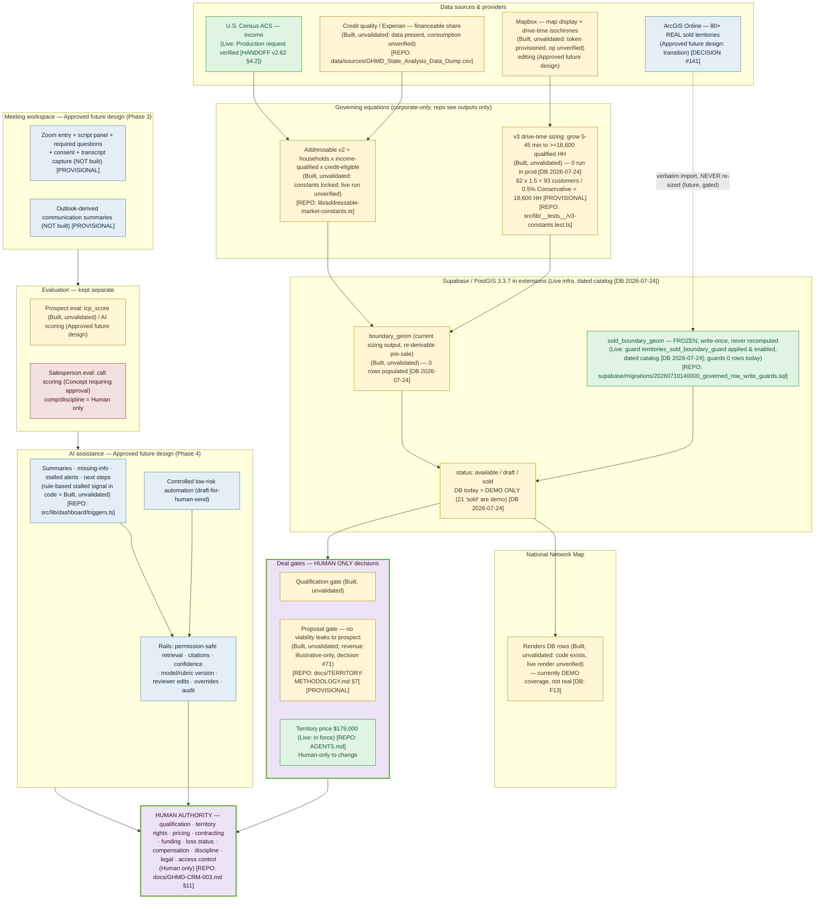

# One-Page System Map — GetHairMD Sales Platform

**Prepared 2026-07-24 · Companion to EXECUTIVE-PRESENTATION.md · Evidence in SOURCE-REGISTER.md**

Status labels: **Live** · **Built, unvalidated** · **In development** · **Approved future design** ·
**Concept requiring approval** · **Human only**. Provisional items marked `[PROVISIONAL]`.
**Evidence standard:** a capability is **Live** only with dated evidence it is operational in the live
Sales Platform environment (`cprltmwwldbxcsunsafl` / production); "a file or migration exists" alone → **Built, unvalidated**.

## Legend

| Color | Meaning |
|---|---|
| 🟢 Green | **Live** — operational today, backed by dated live evidence |
| 🟡 Amber | **Built, unvalidated** — code/schema exists, not proven operational in the live environment |
| 🔵 Blue | **Approved future design** — designed & sequenced, not built |
| 🔴 Red | **Concept requiring approval** — not designed/approved for build |
| 🟣 Purple (bold) | **Human only** — consequential decisions reserved for people |

## The three lines that never bend

1. **ArcGIS → `sold_boundary_geom` is a *verbatim* copy, never a recalculation.** Sold boundaries are
   contracts. [REPO: docs/TERRITORY-METHODOLOGY.md §8.4]
2. **The database today holds demo data only** — the map is illustrative until the real import lands. [DB: F13]
3. **AI assists; humans decide.** Every consequential outcome routes to Human authority with an audit trail. [REPO: docs/GHMD-CRM-003.md §11]
